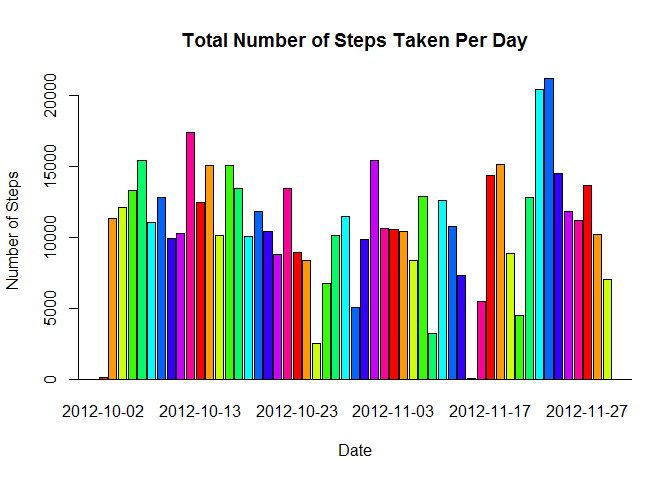
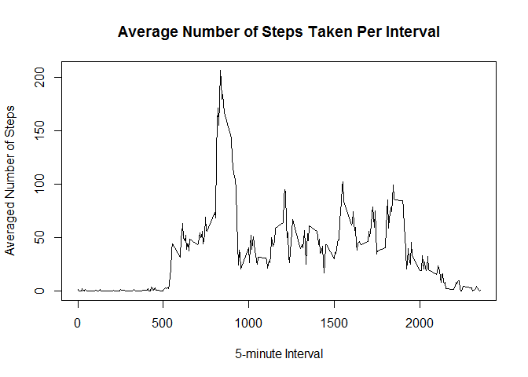
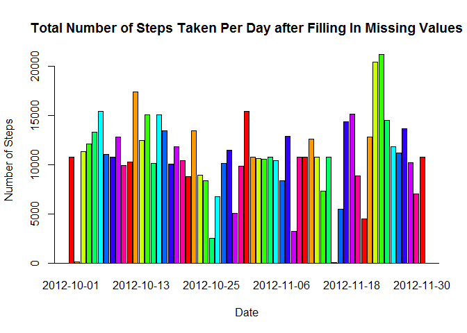
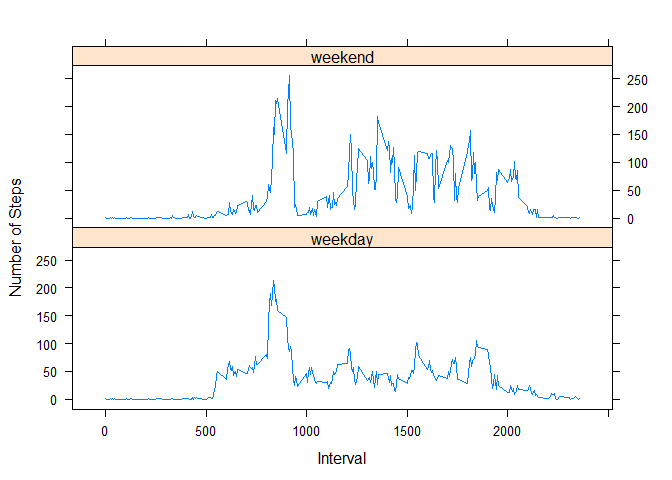

# Reproducible Research: Peer Assessment 1


## Loading and preprocessing the data
* Load the data (i.e. read.csv())


```r
activity = read.csv("activity.csv")
```

* Process/transform the data (if necessary) into a format suitable for your analysis


## What is mean total number of steps taken per day?

* Make a histogram of the total number of steps taken each day


```r
dailySteps = aggregate(steps ~ date, data = activity, sum)
barplot(height = dailySteps$steps, 
        names.arg = dailySteps$date, 
        main = "Total Number of Steps Taken Per Day", 
        xlab = "Date", 
        ylab = "Number of Steps", 
        axes = T, 
        col = rainbow(10))
abline(h = 0)
```

 

* Calculate and report the mean and median total number of steps taken per day


```r
meanDailySteps = mean(dailySteps$steps, na.rm = T)
meanDailySteps
```

```
## [1] 10766.19
```

```r
medianDailySteps = median(dailySteps$steps, na.rm = T)
medianDailySteps
```

```
## [1] 10765
```
The mean total number of steps taken per day is **1.0766189\times 10^{4}** and 
the median total number of steps per day is **10765**.

## What is the average daily activity pattern?

* Make a time series plot (i.e. type = "l") of the 5-minute interval (x-axis)
and the average number of steps taken, averaged across all days (y-axis)


```r
meanStepsByInterval = aggregate(steps ~ interval,
                                data = activity,
                                mean,
                                na.action = na.omit)
plot(meanStepsByInterval, 
     type="l", 
     xlab = "5-minute Interval", 
     ylab = "Averaged Number of Steps",
     main = "Average Number of Steps Taken Per Interval")
```

 

* Which 5-minute interval, on average across all the days in the dataset,
contains the maximum number of steps?


```r
maxMeanStepsByIntervalIndex = which.max(meanStepsByInterval$steps)
intervalNum = meanStepsByInterval[maxMeanStepsByIntervalIndex, 1]
intervalNum
```

```
## [1] 835
```

```r
maxMeanSteps = meanStepsByInterval[maxMeanStepsByIntervalIndex, 2]
maxMeanSteps
```

```
## [1] 206.1698
```
Interval **835** contains the
maximum number of steps, which is
**206.1698113**.

## Imputing missing values

Note that there are a number of days/intervals where there are missing values
(coded as NA). The presence of missing days may introduce bias into some
calculations or summaries of the data.

* Calculate and report the total number of missing values in the dataset
(i.e. the total number of rows with NAs)


```r
naNum = sum(is.na(activity$steps))
naNum
```

```
## [1] 2304
```
Total number of missing values in the dataset is **2304**.

* Devise a strategy for filling in all of the missing values in the dataset. The
strategy does not need to be sophisticated. For example, you could use the mean/
median for that day, or the mean for that 5-minute interval, etc.
* Create a new dataset that is equal to the original dataset but with the
missing data filled in.


```r
filledActivity = activity
for (i in 1 : dim(filledActivity)[1]) {
    if (is.na(filledActivity[i, 1])) {
        filledActivity[i, 1] = meanStepsByInterval[meanStepsByInterval$interval 
                                                   == filledActivity[i, 3], 2]
    }
}
```

* Make a histogram of the total number of steps taken each day and Calculate and
report the mean and median total number of steps taken per day. Do these values
differ from the estimates from the first part of the assignment? What is the
impact of imputing missing data on the estimates of the total daily number of
steps?


```r
filledDailySteps = aggregate(steps ~ date, data = filledActivity, sum)
barplot(height = filledDailySteps$steps, 
        names.arg = filledDailySteps$date, 
        main = "Total Number of Steps Taken Per Day after Filling In Missing Values", 
        xlab = "Date", 
        ylab = "Number of Steps", 
        axes = T, 
        col = rainbow(10))
abline(h = 0)
```

 

```r
filledMeanDailySteps = mean(filledDailySteps$steps, na.rm = T)
filledMeanDailySteps
```

```
## [1] 10766.19
```

```r
filledMedianDailySteps = median(filledDailySteps$steps, na.rm = T)
filledMedianDailySteps
```

```
## [1] 10766.19
```

The mean total number of steps taken per day is **1.0766189\times 10^{4}** 
and median total number of steps taken per day is **1.0766189\times 10^{4}**.
These values are almost the same as the values in the first part, because I use
the mean number of steps in all of the intervals to fill in the NA values.
The impact of imputing missing data is overall limited, since my strategy will not
change the activity pattern in the original dataset. But for those dates with
lots of NAs, the daily numbers of steps differ from the values in the first part
greatly.

## Are there differences in activity patterns between weekdays and weekends?

For this part the weekdays() function may be of some help here. Use the dataset with the filled-in missing values for this part.

* Create a new factor variable in the dataset with two levels - "weekday" and "weekend" indicating whether a given date is a weekday or weekend day.


```r
weekday = as.factor(weekdays(as.POSIXlt(filledActivity$date)))
# I guess R or RStudio figure out I live in China or use a Chinese version of Windows
# , so I have to type Saturday (星期六) and Sunday (星期天) in Chinese.
# I am sorry about this.
# If you know how to tell R or RStudio use English, please let me know.
# Thank you so much.
weekendOrNot = (weekday == '星期六'| weekday == '星期天')
weekday = rep("weekday", dim(filledActivity)[1])
weekday[weekendOrNot] = "weekend"
filledActivity$weekday = as.factor(weekday)
```


* Make a panel plot containing a time series plot (i.e. type = "l") of the 5-minute interval (x-axis) and the average number of steps taken, averaged across all weekday days or weekend days (y-axis). See the README file in the GitHub repository to see an example of what this plot should look like using simulated data.


```r
weekdayActivity = filledActivity[filledActivity$weekday == 'weekday', ]
weekendActivity = filledActivity[filledActivity$weekday == 'weekend', ]
weekdayMeanActivity = aggregate(steps ~ interval,data = weekdayActivity, mean)
weekendMeanActivity = aggregate(steps ~ interval,data = weekendActivity, mean)
weekdayMeanActivity$weekday = "weekday"
weekendMeanActivity$weekday = "weekend"
meanActivity = rbind(weekdayMeanActivity, weekendMeanActivity)
meanActivity$weekday = as.factor(meanActivity$weekday)

library(lattice)
xyplot(steps ~ interval | weekday,
       data = meanActivity,
       layout = c(1, 2),
       xlab = "Interval",
       ylab = "Number of Steps",
       type = "l")
```

 
